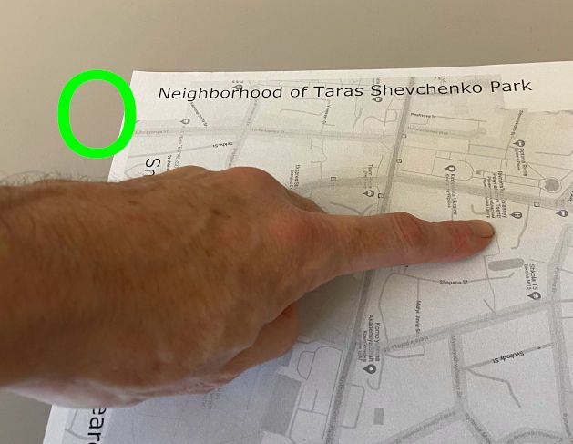
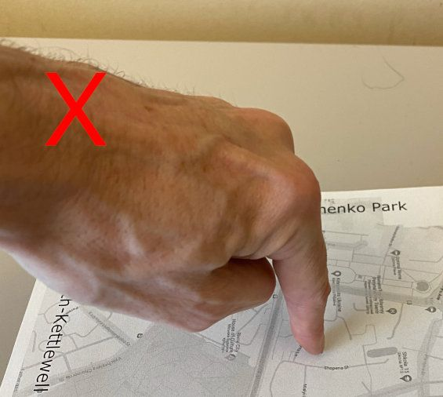

# Simple CamIO 2D

Original research provided by the [Coughlan Lab, The Smith-Kettlewell Eye Research Institute, San Francisco, CA, USA](https://www.coughlan-lab.com/).

Current implementation provided by [Rivne Applied College of Information Technologies, Rivne, Ukraine](https://www.rv-it.college/).

### Installation Instructions

The app can be run either in debug mode (from the command line) or as a background service that starts automatically on boot.
Below are instructions for installation on Debian Bookworm (RPi 4 Model B).

## System deps to install
```bash
sudo apt-get update
sudo apt-get install -y ffmpeg python3-opencv python3-pip python3-venv
# sound and display deps
sudo apt-get install -y xvfb pulseaudio alsa-utils libasound2-dev portaudio19-dev x11vnc libgl1-mesa-glx
# install mediapipe deps
sudo apt install -y libxcb-shm0 libcdio-paranoia-dev libsdl2-2.0-0 libxv1  libtheora0 libva-drm2 libva-x11-2 libvdpau1 libharfbuzz0b libbluray2 libatlas-base-dev libhdf5-103 libgtk-3-0

pip install --upgrade pip
pip install -r requirements.txt
```

## Running in debug mode
1. First ensure your webcam is connected and working.
2. Create and activate a python virtual environment, then install the required libraries from requirements.txt.

```bash
python -m venv venv
source venv/bin/activate
pip install -r requirements.txt
```

3. Copy "models" folder to this directory if not already present.
Ensure the structure is as follows:
```
simple_camio/
├── camio_opt.py
├── run_camio.sh
├── test_mp.py
├── models/
│   ├── CnapMap/
│   │   ├── Audio/
│   │   │   ├── room1.mp3
│   │   │   ├── room2.mp3
│   │   │   └── ...
│   │   ├── CnapFirstFloor.json
│   │   ├── CnapFirstFloor.png
│   │   └── template.png
│   └── ...
```

To test if mediapipe hand tracking is working correctly, run the test_mp.py script:
```bash
python test_mp.py
```
## Running Simple CamIO 2D
To run Simple CamIO 2D, use the run_camio.sh script:
```bash
bash run_camio.sh
```
alternatively, you can run the camio_opt.py script directly with the appropriate input json file:
```bash
python camio_opt.py --input '/path/to/your/model.json'  
```

## Service
Create a systemd service file at:

`sudo nano /etc/systemd/system/camio.service`

Insert the following:

```ini
[Unit]
Description=Run Camio

[Service]
ExecStart=/home/user/camio/run_camio.sh
Restart=always
RestartSec=10
User=user
WorkingDirectory=/home/user/camio
Environment=PYENV_ROOT=/home/user/.pyenv
Environment=TMPDIR=/home/user/tmp
Environment=PATH=/home/user/.pyenv/bin:/home/user/.pyenv/shims:/usr/local/bin:/usr/bin:/bin

[Install]
WantedBy=multi-user.target
```

Now enable and start the service:
```bash
sudo systemctl enable camio.service
sudo systemctl start camio.service
```

To check the status of the service:
```bash
sudo systemctl status camio.service
```
To view logs:
```bash
journalctl -u camio.service -f
```


## About

Simple CamIO 2D is a Python application for interactive tactile map exploration using hand gesture recognition. It replaces stylus-based input with finger tracking, enabling intuitive map interaction.

### Requirements

**Model Configuration**
- A JSON file defining the interactive map model, including component filenames and hotspot mappings
- Reference: `models/UkraineMap/UkraineMap.json`

**Physical Setup**
- Printed map with text features along all four edges
- Template image specified in the JSON model (reference: `models/UkraineMap/template.png`)

**Digital Assets**
- Hotspot zone map with unique color-indexed regions matching template dimensions
- Filename specified in JSON model (reference: `models/UkraineMap/UkraineMap.png`)
- Sound files mapped to zones via the hotspots dictionary

**Software**
- Python 3.9 with: opencv, numpy, scipy, mediapipe, pyglet/pygame
- Versions specified in `requirements.txt`

### Camera and Setup Recommendations

- Position camera above the map for fronto-parallel alignment
- Ensure unobstructed view of all four map edges
- Maintain ~20 cm clearance from map edges to image boundaries
- Keep map well-resolved in frame with adequate hand tracking space

**Controls:**
- Press `h` to reset and recalibrate homography
- Extend index finger with other fingers curled to point
- Keep hand flat against map surface for optimal tracking

**Pointing Gesture:**

 

<details>
<summary>Example</summary>

The pointing gesture is defined as extending the index finger while curling the other fingers towards the palm. This gesture is used to interact with the map and trigger audio feedback for the selected hotspot.

 



</details>

## Acknowledgements
- Based on research by Coughlan Lab, Smith-Kettlewell Eye Research Institute - [Repo](https://github.com/Coughlan-Lab/simple_camio.git)
- Developed by Rivne Applied College of Information Technologies, Ukraine
